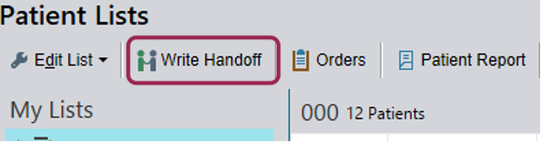

# VUMC General Best Practices

## Handoff

Use the handoff functionality in Epic. 

It saves you from having to spend Friday night writing emails or updating spreadsheets, 
and has nice functionality for to-do items you can use for yourself 
and share with the next fellow without any extra effort.

Go to the "Patient Lists" page. 
Single-click on any patient. 
Select the "Write Handoff" button in the top left.

<figure markdown>

<figcaption markdown> </figcaption>
</figure>

Make sure the context for the "Handoff" section that opens to the right is "Oncology."

(Handoffs are context specific in Epic, so if you write them in e.g. "Internal Medicine,"
they won't show up unless you switch to that context. 
This is a feature, not a bug, 
as multiple services can maintain different to-dos, etc., without cluttering or clobbering the others.)

<figure markdown>

<figcaption markdown> </figcaption>
</figure>

Add a synopsis to the "Synopsis" section,
and any outstanding to-do items to the "To do" section.

!!! tip "Pro Tip for To-Dos"
Add the column "To Do - My Svc." to your facesheet ("Patient Lists" page).
If you use a consistent method for writing to-dos, 
e.g. "[ ] do the thing", "[x] ntd", 
you can sort by that column to bring your undone to-do's together.

<figure markdown>

<figcaption markdown> </figcaption>
</figure>

## Epic message the pool, not the provider

If you message the provider directly, 
they might not see it for a while.
If you instead message their pool, 
the other folks watching that inbox can triage 
and often deal with it without involving the provider at all.
This is good for scheduling appointments, etc.
